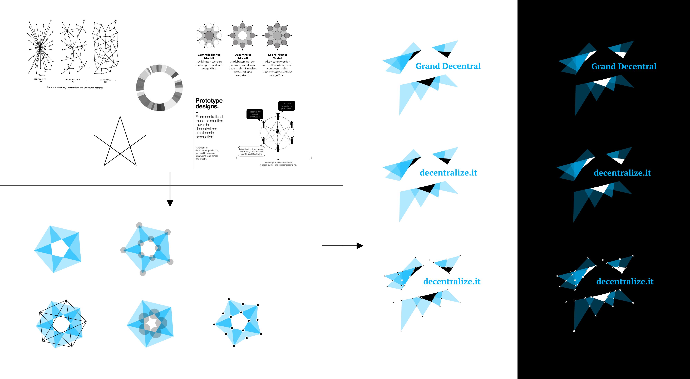

# Branding

Grand Decentral Station is just a working title. The branding should be professional and innovative. It must not be technological by any means. It should be easy to connect with on a "human" level. Something in the line of Mailchimp, Dropbox' illustrative style or the personality of a platform like Instagram. While not copying their design it should be inspired by those. Communication should be very personal and trustful from the beginning. Marketing speech must be avoided as well as hipster-startup-jargon like "this is changing the world". Yet it should clearly show the perspective and possibilities that this system and network offers. 

## Logo

### Logo draft by Jochen Illius (@jocill)

This is the very first draft for a possible Grand Decentral logo. I think Jochen did a great job here to find an abstract representation of a distributed network. I think it is very important to use this kind of meta level in all future drafts to tell a story behind the logo and branding and closely connect it to the vision of GDS. I also love the generic character. A logo that could be created with code and have multiple versions or even infinite version would reflect the concept of GDS very well IMHO – just as long as it stays human enough and likable enough. 

Credits: Jochen Illius
- <http://twitter.com/illepille>
- <http://github.com/jocill>
